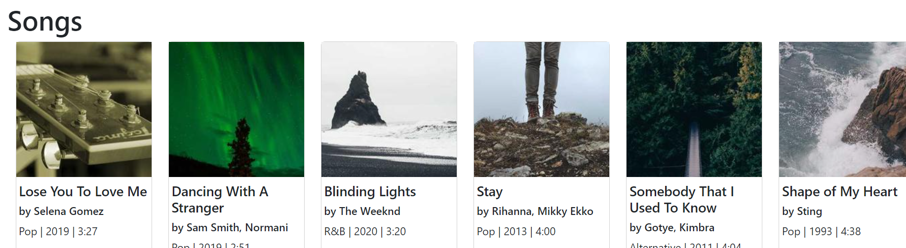
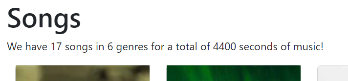
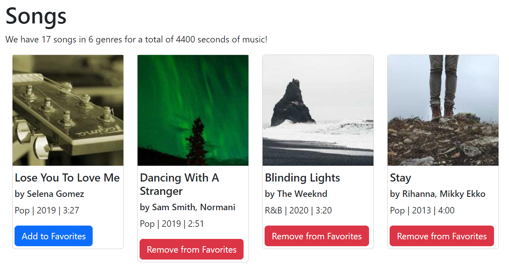
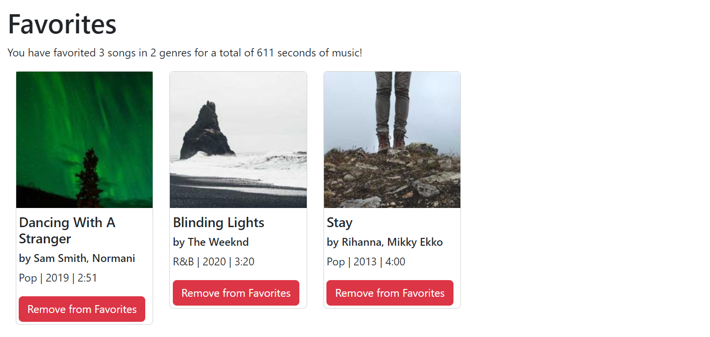

[](https://classroom.github.com/online_ide?assignment_repo_id=10233619&assignment_repo_type=AssignmentRepo)
# CS571-S23 HW05: Badger Beats

Welcome to Badger Beats -- Madison's largest up-and-coming music store! In this assignment, you will develop a *multi-page* application using [react-router](https://reactrouter.com/en/main) where users can favorite their top hits.

There are sections for both implementation *and* design. **Be sure to complete both!**

## Setup

The starter code provided to you was generated using [create-react-app](https://www.npmjs.com/package/create-react-app). Furthermore, [bootstrap](https://www.npmjs.com/package/bootstrap), [react-bootstrap](https://www.npmjs.com/package/react-bootstrap), and [react-router](https://reactrouter.com/en/main) have already been installed. **You should *not* re-run the create-react-app command**. Instead, in this directory, simply run...

```bash
npm install
npm start
```

Then, in a browser, open `localhost:3000`. You should *not* open index.html in a browser; React works differently than traditional web programming! When you save your changes, they appear in the browser automatically. I recommend using [Visual Studio Code](https://code.visualstudio.com/) to do your development work.

The components you will be working on are located in the `components` folder. There are several components here; these are just *suggestions*! You can create your React application however you would like.

## Tasks

### 1. Fetch and Display Song Data

On the "Songs" page of the website, display all of the songs from `https://cs571.org/s23/hw5/api/songs`. Be sure to display the song's name, author, genre, publishing year, length, and cover image. Also, include an appropriate `alt` tag for the cover image. Be sure to make your webpage responsive: display 1 column of cards on `xs` devices, 2 columns on `sm`, 3 columns on `md`, 4 columns on `lg`, and 6 columns on `xl`.




### 2. Display Summary Data

With this data, display a sentence above these cards stating...

```
We have XX songs in YY genres for a total of ZZ seconds of music!
```

... where `XX`, `YY`, and `ZZ` are calculated values. A genre is considered the same if the strings match exactly, e.g. "Pop" and "Pop" are the same genre, but "Pop" and "pop" are not. Furthermore, you can assume the length of a song will always be a string formatted like "3:21" or "0:59" or "12:35" or "78:22" where the minutes and seconds are split by a colon.

I would *encourage* but not *require* you to use declarative functions (specifically [reduce](https://developer.mozilla.org/en-US/docs/Web/JavaScript/Reference/Global_Objects/Array/reduce)) here. You may find [split](https://developer.mozilla.org/en-US/docs/Web/JavaScript/Reference/Global_Objects/String/split) and [parseInt](https://developer.mozilla.org/en-US/docs/Web/JavaScript/Reference/Global_Objects/parseInt) to be helpful as well.



### 3. Favoriting Songs

Add a button to each song that will allow the user to "favorite" the song. When a song is favorited, the button should change so that a user can un-favorite that same song. These favorited songs will then appear on the "Favorites" page implemented in Step 4.




### 4. Display Favorites

Display each of the songs that the user favorited on the "Favorites" page. In addition, display...

```
You have favorited XX songs in YY genres for a total of ZZ seconds of music!
```

... using the same logic as in Step 2 with the totals derived from **just** the favorited songs. When a user chooses to remove a favorite, the card should disappear from the favorites page and the total number of favorited songs, genres, and seconds should be updated.

How you choose to implement this sibling-to-sibling component communication is up to you! In the starter code, I have included some suggestion of using context. You may also choose to store data via `cookies`, `sessionStorage`, or `localStorage`, or you may consider using a third-party state management library like [redux](https://www.npmjs.com/package/redux) or [mobx](https://www.npmjs.com/package/mobx). Data only needs to be persisted between page switches -- if the user refreshes, it is okay for their favorites to be cleared.




That is it for Badger Beats! Now, consider and answer these design questions...

### Design Questions

The following questions ask about principles of interaction and visual design as they relate to Badger Beats. Please answer them by *modifying this README*, replacing "INSERT YOUR RESPONSE HERE" with your response. Thoughtful responses of 2-4 sentences grounded in content from the lectures should suffice.

1. Assume that Badger Beats contains thousands of songs. How would you load and display the results in an efficient manner?

I would implement infinite scrolling to only render a handful of results at a time. I would still get all the songs from the API on page load, but I would only display the first few. I would also restrict the size of the song icons so I could use lower quality images without the images looking grainy. 


2. Assume that Badger Beats contains thousands of songs. How would you help users narrow down their results?

I would add a search bar at the top that users could enter text in to search through the song title or artist. This search functionality would be implemented in the same way as in project 4, with a controlled search component. I would use an controlled search component because updates to the virtual DOM in React are fast and so using controlled components is the preferred method of implementing search functionality. The terms that we found in search would also use infinite scroll if there were a lot of matching songs in order to display the results quickly. There would also be a button to "clear search filters" which would clear all the search filters. 
I would also allow users to do this exact same searching on the favorites page to filter their favorite songs. 

3. What are three aspects of visual design that *you used* in your implementation of Badger Beats?

I used pattern by repeating the song cards over and over in a column format. I also used pattern by repeating the '|' element that separates the song length, song release year, and song genre. 

I achieved balance through symmetry by making each column of song cards the same width - the struture of the page looks the same on either side of a vertical line that splits the page in half no matter the window size for the user

I used perspective by adding a drop shadow to the song cards in each song component. This makes the song components stand out from the background of the page and creates a sharper focus between positive and negative space. This also helps guide user attention to the song cards on the page by making the song card component appear on top of the background space. 

4. What are three aspects of visual design that *could be used* to improve your implementation of Badger Beats?

Focal point is an aspect of visual design that could be used to improve the implementation of Badger Beats. Currently, there is no focal points on the Songs page because every card is the same size. 

Contrast is another aspect of visual design that could be used to improve the implementation of Badger Beats. Adding contrast would help guide user attention across the page. 

We could also more effectively use images (a key part of UI visual design) in the implementation of Badger Beats by replacing "Add to Favorites" with an empty heart that becomes a red, filled-in heart when a user clicks on that icon. The heart is a very common symbol of favorite status and is already in use by Spotify for this purpose. 

### Done! 🥳

*Be sure to complete the design questions above!*

Congrats! Add, commit, and push your files to GitHub Classroom and paste your commit hash in the Canvas assignment.
